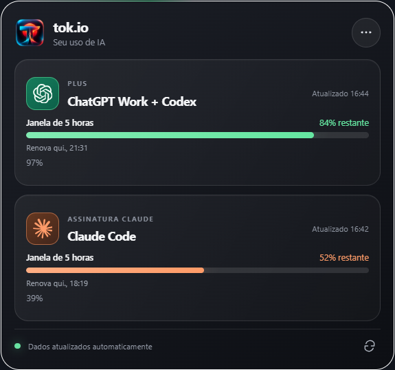

# tok.io

Widget para Windows que mostra quanto resta dos limites de **5 horas** e **semanais** do ChatGPT Work + Codex e do Claude Code. O painel pode ser arrastado, alterna entre os modos grande e compacto e se recolhe na borda da tela. Há também um widget opcional para a tela de bloqueio do Windows.



## Instalar o aplicativo

1. Abra a [versão mais recente](https://github.com/DiulioAires/tok.io/releases/latest).
2. Baixe o instalador `tok.io_*_x64-setup.exe` e execute-o no Windows 11.
3. Abra **tok.io** pelo menu Iniciar.
4. Para mostrar os limites da assinatura, entre nas ferramentas oficiais deste computador:
   - **Codex:** instale o Codex CLI e faça login na conta ChatGPT usada no Work/Codex.
   - **Claude Code:** instale o Claude Code e faça login com `claude /login`.
5. Abra o tok.io e aguarde a primeira atualização. No menu de três pontos, escolha **Painel grande** ou **Compacto**. Para fechar o aplicativo por completo, escolha **Sair do tok.io**.

As porcentagens exibidas são o **saldo restante** de cada janela. O uso da API da OpenAI e da API da Anthropic é uma fonte separada e opcional, configurada no aplicativo com credenciais administrativas próprias. As contas das assinaturas não exigem chave de API.

## Adicionar à tela de bloqueio

O widget da tela de bloqueio é um pacote separado e depende do aplicativo principal aberto para atualizar os dados. O Windows precisa confiar no certificado local que assina esse pacote.

1. Na [mesma release](https://github.com/DiulioAires/tok.io/releases/latest), baixe `tok.io-lockscreen.msix` e `tok.io-lockscreen.cer` para a mesma pasta.
2. Abra o **PowerShell como administrador** nessa pasta e instale o certificado público:

   ```powershell
   Import-Certificate -FilePath .\tok.io-lockscreen.cer -CertStoreLocation Cert:\LocalMachine\TrustedPeople
   ```

3. Instale o widget:

   ```powershell
   Add-AppxPackage -Path .\tok.io-lockscreen.msix
   ```

4. Vá a **Configurações → Personalização → Tela de bloqueio → Widgets → Adicionar widget** e escolha **tok.io**. Bloqueie o computador com **Win + L** para conferir. A [documentação da Microsoft](https://support.microsoft.com/pt-br/windows/experience/personalization/customize-the-lock-screen-in-windows) mostra onde gerenciar os widgets da tela de bloqueio.

Se os números não aparecerem, abra o tok.io, confirme que Codex e Claude Code estão conectados e espere até um minuto. O pacote da tela de bloqueio lê um retrato local atualizado pelo aplicativo; depois de cerca de dez minutos sem o aplicativo, o retrato é considerado antigo.

## Executar a partir do código

No Windows, instale [Node.js](https://nodejs.org/), [Rust](https://rustup.rs/) e os [pré-requisitos do Tauri para Windows](https://v2.tauri.app/start/prerequisites/). Depois:

```powershell
git clone https://github.com/DiulioAires/tok.io.git
cd tok.io
npm ci
npm run tauri dev
```

Para gerar o instalador Windows:

```powershell
npm run tauri build -- --bundles nsis
```

O código do widget da tela de bloqueio fica em `windows-lockscreen/` e usa .NET 8 e Windows App SDK. O pacote MSIX e o certificado público já estão disponíveis na release; não é necessário compilá-los para instalar.

## Limitações

- Os saldos da assinatura dependem de sessões válidas do Codex CLI e do Claude Code no computador.
- O Windows controla o espaço externo e o menu do card na tela de bloqueio. O tok.io desenha os indicadores dentro da área de conteúdo oferecida pelo sistema.
- O widget da tela de bloqueio está disponível somente nas versões do Windows que oferecem **Adicionar widget** nessa tela.
